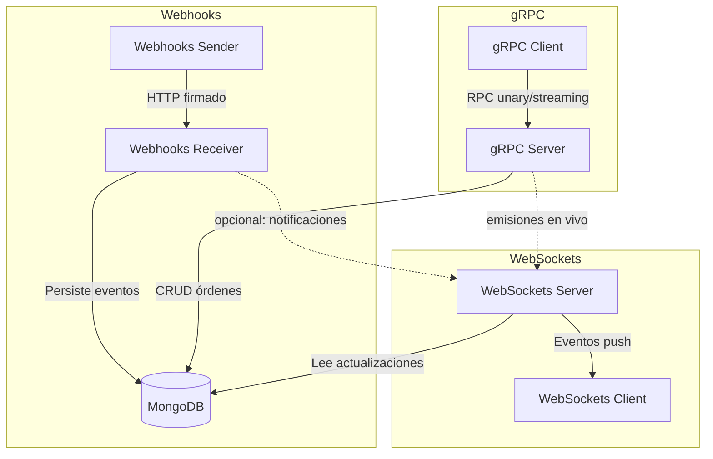

# realtime-labs-ts

Laboratorio integral de tiempo real que reúne Webhooks, gRPC y WebSockets en un solo monorepo TypeScript. El objetivo es que experimentes, de punta a punta, cómo se conectan patrones de integración modernos en un backend poliglota.

## Introducción al laboratorio

Este laboratorio está dividido en tres dominios de tiempo real que conviven sobre la misma base de datos MongoDB:

- **Webhooks**: recepción y emisión de eventos HTTP firmados, con verificación HMAC y reintentos.
- **gRPC**: servicios de alto rendimiento para crear y consultar órdenes, con operaciones unary, server streaming y bidireccional.
- **WebSockets (Socket.IO)**: canales full-duplex para chat y notificaciones en vivo que reaccionan a los cambios generados por los otros módulos.

Durante el recorrido vas a trabajar con **cuatro carpetas principales** dentro del monorepo:

1. `shared/`: paquete común con logger, conexión a MongoDB y tipos reutilizables.
2. `webhooks/`: servicios HTTP con un `receiver/` Express y un `sender/` que emula proveedores externos.
3. `grpc/`: implementación de `server/` y `client/` gRPC para operar sobre las órdenes.
4. `websockets/`: servidor Socket.IO (`server/`) y cliente React (`client-react/`) para visualizar los eventos en directo.

El siguiente gráfico mermaid resume cómo se conectan:



## Prerrequisitos

- Node.js LTS (20.x)
- npm >= 9
- Docker
- Docker Compose

## Preparación e instalación

1. Cloná el repositorio y posicionate en la raíz del proyecto.
2. Duplicá los ejemplos de variables de entorno:

```bash
cp .env.example .env
npm install
```

3. Revisá el archivo `.env` y asegurate de definir valores válidos para:
    - `WEBHOOK_SECRET` (mínimo 10 caracteres, coincide con el sender y receiver).
    - `JWT_SECRET` y `WS_TOKEN` (utilizados por gRPC y WebSockets).
4. Si querés personalizar las conexiones desde el cliente React podés crear `websockets/client-react/.env.local`, aunque por defecto el compose ya inyecta las variables adecuadas.

## Pasos para iniciar todo (modo recomendado para alumnos)

> 💡 El stack completo se levanta con Docker Compose utilizando perfiles para cada dominio. Los pasos siguientes asumen que Docker Desktop está activo.

1. **Compilar y levantar todos los servicios**

```bash
docker compose --profile webhooks --profile grpc --profile websockets up -d --build
```

Este comando construye las imágenes (cuando es necesario) y arranca MongoDB + los servicios de Webhooks, gRPC, WebSockets y el cliente React servido vía Nginx.

2. **Verificar que todo esté en ejecución**

```bash
docker compose ps
```

Todos los contenedores deben aparecer en estado `Up`. Si alguno está `Exited`, revisá sus logs con `docker compose logs <servicio>`.

3. **Detener el laboratorio cuando termines**

```bash
docker compose down
```

> Si preferís un enfoque más granular, podés levantar cada perfil por separado (`--profile webhooks up -d`, etc.), pero para prácticas guiadas se recomienda iniciar todo junto y observar las interacciones cruzadas.

## Ejecución local (modo alternativo)

```bash
docker compose --profile webhooks up -d
docker compose --profile grpc up -d
docker compose --profile websockets up -d
```

Para detener todos los servicios:

```bash
docker compose down
```

Para un desarrollo más clásico, podés ejecutar cada workspace con watch/hot-reload (requiere MongoDB local o el contenedor levantado aparte):

```bash
npm run dev:webhooks
npm run dev:grpc
npm run dev:websockets
```

## Puertos expuestos

- Webhooks Receiver: 3001
- Webhooks Sender: 3002
- gRPC Server: 50051
- gRPC Client (HTTP bridge): 50052
- WebSockets Server: 3003
- WebSockets Client (Vite): 5173

## Escenarios de prueba paso a paso y resultados esperados

Sigue esta ruta para comprobar que todo quedó desplegado correctamente. Cada paso indica lo que deberías ver si todo está en orden.

1. **Webhook Sender ➜ Receiver**
   - Ejecutá desde tu terminal:
     ```bash
     curl -sS http://localhost:3002/send
     ```
   - **Resultado esperado**: la respuesta JSON `{"status":"sent","count":2}` y en `docker compose logs webhooks-receiver` mensajes `Handling order.created event` con código 202.

2. **gRPC Client ➜ gRPC Server**
   - El contenedor `grpc-client` se ejecuta automáticamente y luego finaliza. Verificá su salida con:
     ```bash
     docker compose logs grpc-client
     ```
   - **Resultado esperado**: una línea similar a `Order created via CLI: {...}` indicando que se creó una orden y fue persistida.

3. **WebSockets Server + Cliente React**
   - Abrí `http://localhost:5173` en tu navegador.
   - **Resultado esperado**: el dashboard “Realtime Labs Websocket Client” con secciones de Chat y Notificaciones. El inspector de red debe mostrar conexiones WebSocket exitosas a `ws://localhost:3003`.
   - Para ver notificaciones en vivo, vuelve a ejecutar el sender (`curl http://localhost:3002/send`) y observá cómo aparecen al inicio de la lista.

4. **Monitoreo general**
   - Confirmá el estado general:
     ```bash
     docker compose ps
     ```
   - **Resultado esperado**: todos los contenedores en estado `Up` excepto `grpc-client`, que figura como `Exited (0)` porque corre una sola vez.

## Seguimiento de logs por flujo

> Sugerencia: abrí una terminal adicional en modo *follow* (`docker compose logs -f ...`) para cada servicio y dejala abierta mientras ejecutás los pasos. Las trazas utilizan el logger compartido de `shared/`, por lo que verás timestamps y metadatos útiles.

### 1. Webhook Sender ➜ Receiver ➜ Notificaciones

1. Observá los servicios involucrados:
  ```bash
  docker compose logs -f webhooks-sender webhooks-receiver ws-server
  ```
2. Dispará el escenario:
  ```bash
  curl -sS http://localhost:3002/send
  ```
3. Validá el recorrido en los logs:
  - `webhooks-sender`: `Webhook sender listening on port 3002` confirma que el emisor está listo.
  - `webhooks-receiver`: entradas `Handling order.created event` y `Emitting WebSocket notification` muestran que el payload fue verificado y propagado al canal de notificaciones.
  - `ws-server`: mensajes `Client connected to notifications namespace` (cuando el front se conecta) y `order:update` enviados al namespace confirman la entrega push.

### 2. gRPC Client ➜ gRPC Server ➜ MongoDB

1. Mantené a la vista el servidor gRPC:
  ```bash
  docker compose logs -f grpc-server
  ```
2. Ejecutá el cliente CLI (vuelve a correrlo cuantas veces quieras):
  ```bash
  docker compose run --rm grpc-client
  ```
3. Lo que deberías ver:
  - Salida del CLI: `Order created via CLI: {...}` con el payload generado.
  - `grpc-server`: trazas `CreateOrder succeeded` con `orderId` y `customerEmail`, y en peticiones de lectura `GetOrders streaming response` indicando cuántas órdenes se enviaron al cliente.
  - Opcional: `docker compose logs mongo` mostrará conexiones nuevas cuando el servidor persiste documentos (`Connection accepted`).

### 3. WebSockets (Chat + Notificaciones)

1. Acompañá el backend en tiempo real:
  ```bash
  docker compose logs -f ws-server
  ```
2. Abrí la UI en `http://localhost:5173` y asegurate de iniciar sesión en el navegador con el token inyectado.
3. Qué buscar en la consola:
  - Al cargar la página verás `Client connected to chat namespace` y `Client connected to notifications namespace`.
  - Enviar un mensaje desde el panel **Chat** produce `Chat message broadcasted` con el `socketId` y el `messageId` persistido.
  - Si ejecutás nuevamente `curl http://localhost:3002/send`, el `ws-server` emite `order:update` y el panel **Notificaciones** refleja la entrada más reciente.

  > ℹ️ Para más detalles sobre la UI, consultá `websockets/client-react/README.md`.

## Comandos útiles adicionales

```bash
# Logs detallados del servidor de webhooks
docker compose logs -f webhooks-receiver

# Ejecutar nuevamente el cliente gRPC de forma aislada
docker compose run --rm grpc-client

# Salida ordenada de todos los contenedores
docker compose ps
```

## Ejercicios sugeridos

- Extender el sistema de Webhooks con nuevos handlers y rotación de secretos.
- Crear un nuevo método gRPC client-streaming y agregar logs estructurados.
- Persistir histórico de chat en WebSockets y añadir paginación.

## Flujo de funcionamiento

1. Los escenarios de pruebas pueden comenzar disparando eventos desde **Webhooks Sender**, que firma cada payload y los envía al **Receiver**.
2. El **Receiver** valida cabeceras y firma, almacena el evento en MongoDB e invoca los handlers configurados (por ejemplo, para actualizar estados de órdenes).
3. El **gRPC Server** expone operaciones que leen y escriben sobre la misma colección de órdenes, permitiendo consultas masivas (`GetOrders`) o flujos bidireccionales (`ChatOrders`).
4. El **gRPC Client** actúa como consumidor externo y facilita probar rápidamente los distintos RPCs.
5. El **WebSockets Server** observa los cambios relevantes (p. ej. actualizaciones de órdenes) y los publica a los namespaces de chat y notificaciones.
6. La aplicación **WebSockets Client (React)** mantiene conexiones Socket.IO para recibir actualizaciones sin refrescar la página, mostrando mensajes en el chat y avisos en el panel de notificaciones.

Estos laboratorios pueden ejecutarse de forma independiente o encadenarse para simular un flujo integral: webhooks que generan órdenes, procesamiento gRPC sobre esos datos y distribución en tiempo real vía WebSockets.
